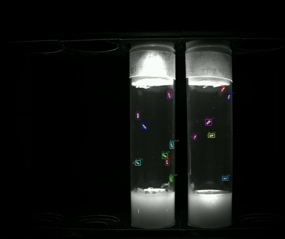
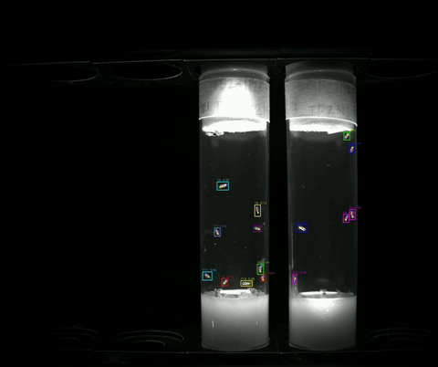
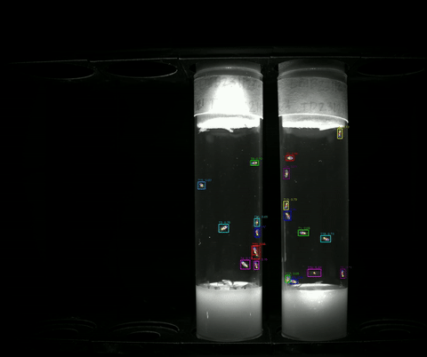
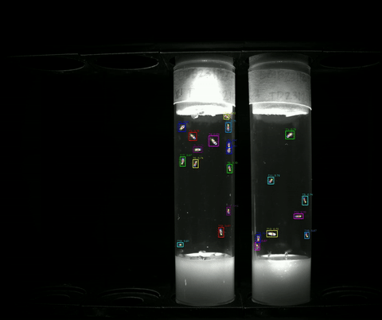
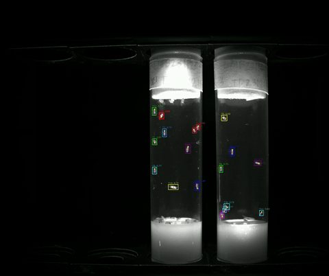

# Fruit fly pose estimation and vial tracking

Pose-based detection and multi-fly tracking for *Drosophila* in standard food-vial recordings (approximately **2448×2048**, 30 fps). This repository ships a trained **YOLO11m-Pose** model (**three keypoints**: head, thorax, abdomen), inference scripts (**ByteTrack**), a small reproducible **YOLO dataset** slice, and **exported training metrics / figures**.

> **Large tracking bundle:** run **231127** curvature-corrected exports live under **`data/run231127_github_release/`** as **XZ** shards, stored with **[Git LFS](https://git-lfs.com/)** (~6 GB payload). Install `git-lfs`, run **`git lfs install`** once, then **`git lfs pull`** after clone so the `.xz` files materialize as real archives—not the small pointer stubs Git stores in commits. Plain Git cannot accept a multi-gigabyte single push pack on GitHub, so Git LFS is required for this subtree; see **`data/run231127_github_release/README.md`** and [`docs/06_large_tracking_assets.md`](docs/06_large_tracking_assets.md).

---

## Layout

```
.
├── CHANGELOG.md
├── README.md
├── LICENSE
├── requirements.txt
├── requirements-docker.txt
├── Dockerfile.gpu
├── Dockerfile.cpu
├── docker-compose.yml
├── Makefile
├── pipeline/
│   ├── README.md
│   └── stages/
│       ├── stage_01_environment/README.md
│       ├── stage_02_dataset_config_weights/
│       │   ├── dataset/yolo_pose/        # data.yaml + train/valid/test
│       │   ├── configs/tracking.yaml
│       │   └── weights/fruitfly_pose_yolo11m.pt
│       ├── stage_03_training/train_scaled_model.py
│       ├── stage_04_inference_tracking/
│       │   ├── track_video.py
│       │   └── load_and_infer.py       # Compose cpu-smoke
│       ├── stage_05_evaluation_reports/results/   # training_metrics.csv, curves, tracked_videos/, …
│       └── stage_06_publish_release/package_run231127_github_release.sh
├── scripts/                    # symlinks → executable stages above
├── data/
│   ├── README.md
│   ├── run231127_github_release/   # Git LFS xz bundle (~6 GB)
│   ├── roboflow/roboflow_export_yolov8_pose.zip
│   └── samples/
├── docs/
└── examples/README.md           # pointers (smoke script lives in stage 04)
```

See [`CHANGELOG.md`](CHANGELOG.md) for v2 restructuring notes. Canonical pipeline narrative: **[`pipeline/README.md`](pipeline/README.md)** ↔ [`docs/TRAINING_STAGES.md`](docs/TRAINING_STAGES.md).

---

## Sample videos (model applied)

Qualitative demos with **detections / keypoints / track IDs overlaid**:

| Clip | Location |
|------|-----------|
| ~8 s, full-res (**2448×2048**, H.264 ~2 MB; **per-track colors**) | [`pipeline/stages/stage_05_evaluation_reports/results/tracked_videos/sample_pose_bytetrack_8s.mp4`](pipeline/stages/stage_05_evaluation_reports/results/tracked_videos/sample_pose_bytetrack_8s.mp4) |
| ~8 s, ~720p preview (H.264, small; same clip) | [`pipeline/stages/stage_05_evaluation_reports/results/tracked_videos/sample_pose_bytetrack_preview_720p.mp4`](pipeline/stages/stage_05_evaluation_reports/results/tracked_videos/sample_pose_bytetrack_preview_720p.mp4) |
| Three more ~8 s vials (batch QA; same viz) | [`pipeline/stages/stage_05_evaluation_reports/results/tracked_videos/sample_batch/`](pipeline/stages/stage_05_evaluation_reports/results/tracked_videos/sample_batch/) |

### Full Task3 batch (~60 s × 5, previews + in-browser playback)

GitHub Markdown does **not** render HTML `<video>` tags in READMEs, so embedded “live” motion here uses short **GIF** loops (**~3 s**) from each clip. **Click any GIF or the link under it** to open the corresponding **full ~60 s H.264** file — GitHub’s file page streams it in your browser (**no clone** required).

<details>
<summary>Optional: HTML5 players (local served file)</summary>

For five inline `<video>` players that pull MP4s from `raw.githubusercontent.com`, open **[`docs/batch_videos_player.html`](docs/batch_videos_player.html)** via a local HTTP server or GitHub Pages (see notes at bottom of that file).
</details>

[**Batch folder + provenance**](pipeline/stages/stage_05_evaluation_reports/results/tracked_videos/batch_full/README.md)

#### Batch 1 — `FVI_20231127_151027_img0002.mp4`

[](https://github.com/SiriYellu/Fruitfly-pose-tracking/blob/main/pipeline/stages/stage_05_evaluation_reports/results/tracked_videos/batch_full/b1_tracked_60s_h264.mp4)

[▶ Full video ~60 s (stream on GitHub)](https://github.com/SiriYellu/Fruitfly-pose-tracking/blob/main/pipeline/stages/stage_05_evaluation_reports/results/tracked_videos/batch_full/b1_tracked_60s_h264.mp4)

#### Batch 2 — `FVI_20231127_151027_img0003.mp4`

[](https://github.com/SiriYellu/Fruitfly-pose-tracking/blob/main/pipeline/stages/stage_05_evaluation_reports/results/tracked_videos/batch_full/b2_tracked_60s_h264.mp4)

[▶ Full video ~60 s](https://github.com/SiriYellu/Fruitfly-pose-tracking/blob/main/pipeline/stages/stage_05_evaluation_reports/results/tracked_videos/batch_full/b2_tracked_60s_h264.mp4)

#### Batch 3 — `FVI_20231127_151027_img0004.mp4`

[](https://github.com/SiriYellu/Fruitfly-pose-tracking/blob/main/pipeline/stages/stage_05_evaluation_reports/results/tracked_videos/batch_full/b3_tracked_60s_h264.mp4)

[▶ Full video ~60 s](https://github.com/SiriYellu/Fruitfly-pose-tracking/blob/main/pipeline/stages/stage_05_evaluation_reports/results/tracked_videos/batch_full/b3_tracked_60s_h264.mp4)

#### Batch 4 — `FVI_20231127_151027_img0005.mp4`

[](https://github.com/SiriYellu/Fruitfly-pose-tracking/blob/main/pipeline/stages/stage_05_evaluation_reports/results/tracked_videos/batch_full/b4_tracked_60s_h264.mp4)

[▶ Full video ~60 s](https://github.com/SiriYellu/Fruitfly-pose-tracking/blob/main/pipeline/stages/stage_05_evaluation_reports/results/tracked_videos/batch_full/b4_tracked_60s_h264.mp4)

#### Batch 5 — `FVI_20231127_151027_img0006.mp4`

[](https://github.com/SiriYellu/Fruitfly-pose-tracking/blob/main/pipeline/stages/stage_05_evaluation_reports/results/tracked_videos/batch_full/b5_tracked_60s_h264.mp4)

[▶ Full video ~60 s](https://github.com/SiriYellu/Fruitfly-pose-tracking/blob/main/pipeline/stages/stage_05_evaluation_reports/results/tracked_videos/batch_full/b5_tracked_60s_h264.mp4)

See [`pipeline/stages/stage_05_evaluation_reports/results/tracked_videos/README.md`](pipeline/stages/stage_05_evaluation_reports/results/tracked_videos/README.md) for provenance.

---

## Quick start — inference

```bash
python -m venv .venv && source .venv/bin/activate
pip install --upgrade pip
pip install torch torchvision --index-url https://download.pytorch.org/whl/cu126   # adapt to your CUDA
pip install -r requirements.txt

# From repo root (GPU):
python scripts/track_video.py \
  --video /path/to/vial_clip.mp4 \
  --output outputs/run_a/ \
  --device cuda:0
```

Produces `*_tracking.csv` with columns for frame index, ByteTrack IDs, bbox, normalized confidences, and keypoint XY + visibility bits.

Detailed flags and Ultralytics quirks: [`docs/04_inference.md`](docs/04_inference.md).

---

## Training / fine-tuning

The production checkpoint was optimized on a **resolution-matched** (scaled/full-frame) annotated corpus. Bundled **`pipeline/stages/stage_02_dataset_config_weights/dataset/yolo_pose/`** is a **minimal** pedagogical subset (demo + sanity checks)—scale up privately with your expanded frames before expecting production-level metrics.

```bash
python scripts/train_scaled_model.py \
  --dataset /your/scaled_dataset \
  --project runs/train \
  --epochs 200 --imgsz 2448 --batch 4
```

More context: [`docs/03_training.md`](docs/03_training.md).

---

## Results bundled in-repo

| Item | Location |
|------|-----------|
| Per-epoch validation metrics CSV | [`pipeline/stages/stage_05_evaluation_reports/results/training_metrics.csv`](pipeline/stages/stage_05_evaluation_reports/results/training_metrics.csv) |
| Training curve PNG set | [`pipeline/stages/stage_05_evaluation_reports/results/training_curves/`](pipeline/stages/stage_05_evaluation_reports/results/training_curves/) |
| Confusion-matrix PNG set | [`pipeline/stages/stage_05_evaluation_reports/results/confusion_matrices/`](pipeline/stages/stage_05_evaluation_reports/results/confusion_matrices/) |
| Human-readable metric summary | [`docs/05_training_and_metrics.md`](docs/05_training_and_metrics.md) |

Approximate headline numbers at **epoch 200** (see CSV): pose **mAP50 ≈ 0.985**, pose **mAP50–95 ≈ 0.975**.

---

## Sample tracking CSVs (`data/samples/`)

See [`data/README.md`](data/README.md). Shipped artifacts:

1. **`frame_by_frame/`** — one complete *run 231127* clip (pixels, track IDs).
2. **`curvature_corrected/`** — first **50,000** rows of `tracks_corrected_clip15.csv` illustrating millimeter curvature-corrected schema.

Full 48 × 30 min exports + merged >10 GB corpus: [`docs/06_large_tracking_assets.md`](docs/06_large_tracking_assets.md).

---

## Reproducibility — training stages & Docker

| Resource | Purpose |
|----------|---------|
| [`pipeline/README.md`](pipeline/README.md) | **Stage 01–06**: code lives under `pipeline/stages/`; `scripts/` are symlinks |
| [`docs/TRAINING_STAGES.md`](docs/TRAINING_STAGES.md) | Same roadmap with doc deep-links |
| [`docs/DOCKER.md`](docs/DOCKER.md) | GPU/CPU images, Compose services, troubleshooting |
| `Dockerfile.gpu` / `Dockerfile.cpu` | Pinned PyTorch CUDA base + Ultralytics deps |
| `requirements-docker.txt` | Version-pinned installs **on top** of the GPU base image |
| `docker-compose.yml` | `gpu`, `gpu-train`, `gpu-track`, `cpu-smoke` services |
| `Makefile` | `make docker-shell-gpu`, `make docker-train-sm`, etc.

Quick GPU shell:

```bash
docker compose build gpu
docker compose run --rm --gpus all gpu bash
```

---

## Documentation index

| Doc | Topics |
|-----|--------|
| [`pipeline/README.md`](pipeline/README.md) | Stage-numbered codebase map |
| [`docs/00_overview.md`](docs/00_overview.md) | End-to-end pipeline narrative |
| [`docs/01_setup.md`](docs/01_setup.md) | Python, CUDA, common install failures |
| [`docs/02_data.md`](docs/02_data.md) | Annotations, keypoint order, Roboflow |
| [`docs/03_training.md`](docs/03_training.md) | Resolution scaling, epochs, GPUs |
| [`docs/TRAINING_STAGES.md`](docs/TRAINING_STAGES.md) | Stage table — easiest replication roadmap |
| [`docs/04_inference.md`](docs/04_inference.md) | Confidence, trackers, throughput |
| [`docs/05_training_and_metrics.md`](docs/05_training_and_metrics.md) | Parsing `training_metrics.csv` |
| [`docs/06_large_tracking_assets.md`](docs/06_large_tracking_assets.md) | Multi-GB bundles & hosting playbook |
| [`docs/DOCKER.md`](docs/DOCKER.md) | Docker + Compose recipes |

---

## Citation

If you use this codebase or checkpoints in research, please cite the GitHub repository and (when published) the associated paper—you can adapt:

```bibtex
@misc{fruitfly_pose_tracking_repo,
  title        = {Fruit Fly Pose Tracking},
  author       = {Yellu, Siri},
  year         = {2026},
  howpublished = {\url{https://github.com/SiriYellu/Fruitfly-pose-tracking}},
  note         = {YOLO11m pose + ByteTrack inference; training metrics \& weights}
}
```

---

## Contributing / issues

Open GitHub Issues for reproducibility gaps (paths, Ultralytics warnings, CUDA wheels). Prefer **minimal** reproducible snippets when reporting bugs.

---

**Maintainer**: [SiriYellu](https://github.com/SiriYellu) · Repo: [`Fruitfly-pose-tracking`](https://github.com/SiriYellu/Fruitfly-pose-tracking)
